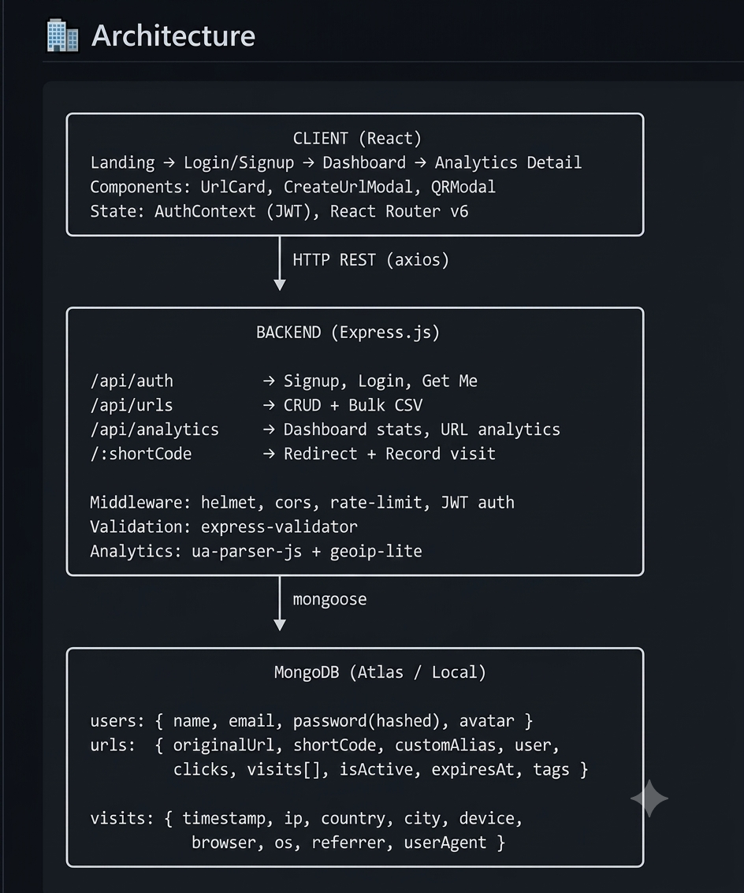
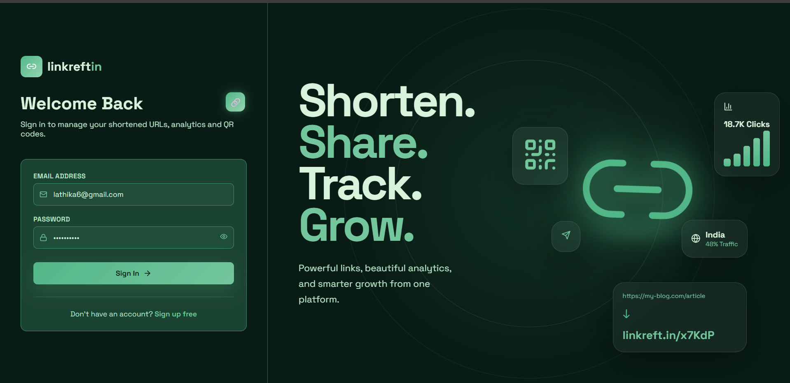
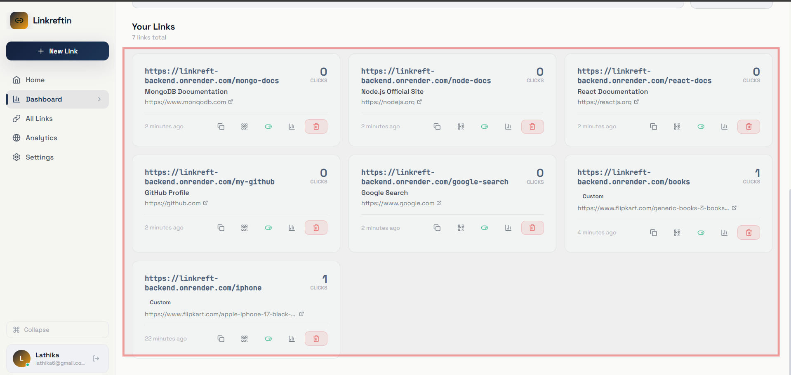
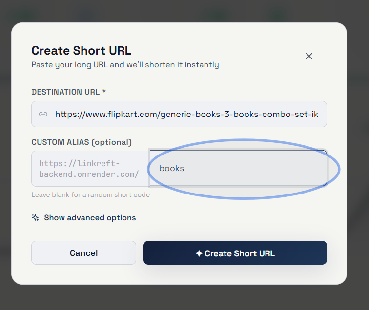
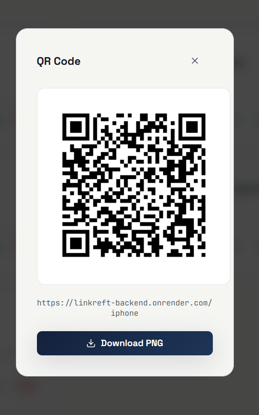
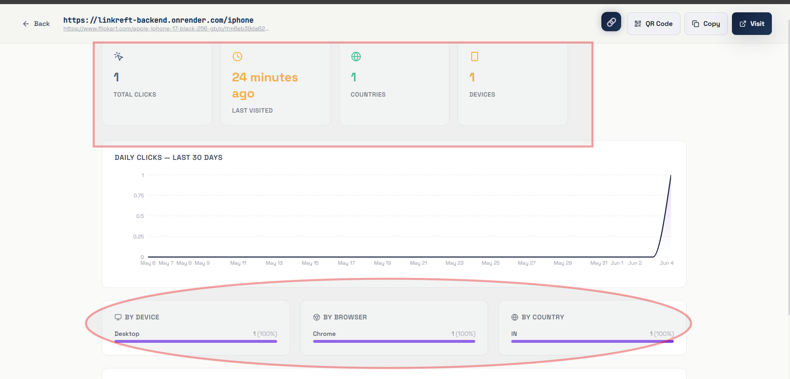
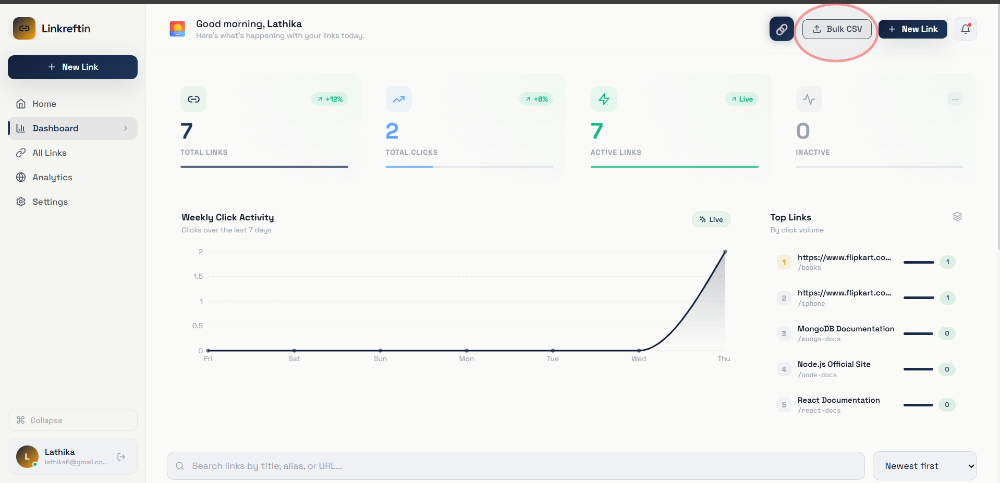
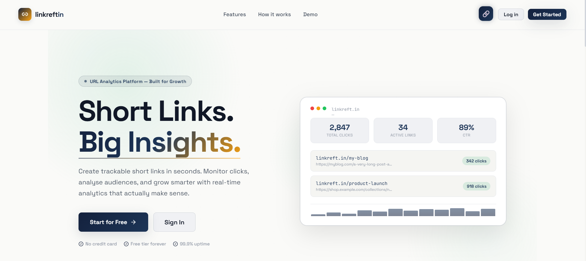
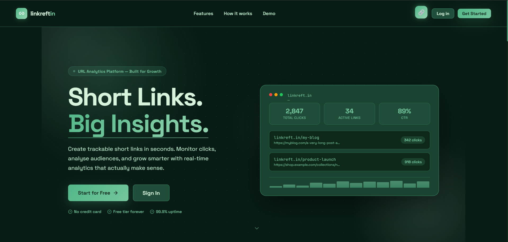

# 🔗 linkreft — Smart URL Shortener with Analytics

> A full-stack URL shortener with real-time analytics, custom aliases, QR code generation, device/geo tracking, bulk CSV upload, and a stunning dark-themed dashboard.

---

## 📺 Demo Video

> 🎬 **[Watch the Demo Video](https://www.loom.com/share/f4e03fee67974e339233fe3a07df4cc9)**

---

## ✨ Features

### Core (Mandatory)
- ✅ **User Authentication** — Signup/Login with JWT, bcrypt password hashing
- ✅ **URL Shortening** — Nanoid-based 6-char unique codes, server-side redirect
- ✅ **URL Validation** — Frontend + backend validation (http/https required)
- ✅ **User Dashboard** — View, search, sort, paginate all your links
- ✅ **Click Analytics** — Per-URL click count, timestamps, visit history
- ✅ **Delete Links** — One-click deletion with confirmation
- ✅ **Copy Short URL** — Clipboard copy with visual feedback
- ✅ **Protected Routes** — Authenticated users only see their own links

### Bonus Features Implemented
- 🎨 **Custom Aliases** — User-defined short codes (e.g. `yourdomain.com/my-brand`)
- 📱 **QR Code Generation** — Per-link QR codes with PNG download
- ⏰ **Link Expiry** — Set expiration dates; expired links auto-redirect
- 🌍 **Geolocation Analytics** — Country + city tracking via IP
- 💻 **Device/Browser Analytics** — UA-Parser detects device, browser, OS
- 📊 **Daily Click Charts** — 30-day area chart + 7-day bar chart on dashboard
- 📋 **Bulk URL Shortening** — Upload CSV with `url`, `alias`, `title` columns
- 🔄 **Toggle Active/Inactive** — Enable/disable links without deleting
- ✏️ **Edit URL** — Update original URL, title, description, expiry, tags
- 🏷️ **Tags** — Organize links with custom tags
- 📈 **Top Links** — Dashboard widget showing top performers
- 🌐 **Public Stats** — API endpoint for public link stats

---

## 🏗️ Architecture Diagram


---

## 🚀 Quick Start

### Prerequisites
- Node.js 18+
- MongoDB (local or [MongoDB Atlas](https://cloud.mongodb.com) free tier)
- npm or yarn

### 1. Clone & Install

```bash
git clone https://github.com/Lathika-Sri/linkreft-url-shortener.git
cd linkreft-url-shortener

# Install backend
cd backend && npm install

# Install frontend
cd ../frontend && npm install
```

### 2. Configure Environment

```bash
# Backend
cd backend
cp .env.example .env
# Edit .env with your values:
#   MONGODB_URI=mongodb://localhost:27017/urlshortener
#   JWT_SECRET=your_random_secret_here
#   BASE_URL=http://localhost:5000
#   FRONTEND_URL=http://localhost:3000

# Frontend
cd ../frontend
cp .env.example .env
# Edit .env:
#   REACT_APP_API_URL=http://localhost:5000/api
#   REACT_APP_BASE_URL=http://localhost:5000
```

### 3. Run Development Servers

```bash
# Terminal 1 — Backend
cd backend
npm run dev
# → Server on http://localhost:5000

# Terminal 2 — Frontend
cd frontend
npm start
# → App on http://localhost:3000
```

### 4. (Optional) Docker Compose

```bash
docker-compose up --build
# Backend: http://localhost:5000
# Frontend: http://localhost:3000
```

---

## 📡 API Reference

| Method | Endpoint | Auth | Description |
|--------|----------|------|-------------|
| POST | `/api/auth/signup` | ❌ | Create account |
| POST | `/api/auth/login` | ❌ | Login |
| GET | `/api/auth/me` | ✅ | Get current user |
| GET | `/api/urls` | ✅ | List user's URLs |
| POST | `/api/urls` | ✅ | Create short URL |
| GET | `/api/urls/:id` | ✅ | Get single URL |
| PUT | `/api/urls/:id` | ✅ | Update URL |
| DELETE | `/api/urls/:id` | ✅ | Delete URL |
| POST | `/api/urls/bulk/csv` | ✅ | Bulk create via CSV |
| GET | `/api/analytics/dashboard` | ✅ | Dashboard stats |
| GET | `/api/analytics/url/:id` | ✅ | URL analytics |
| GET | `/api/analytics/public/:code` | ❌ | Public stats |
| GET | `/:shortCode` | ❌ | **Redirect** (server-side) |

---

## 📦 Bulk CSV Format

Upload a CSV with these columns to create multiple URLs:

```csv
url,alias,title
https://example.com,my-link,My Link Title
https://other.com,,Auto-generated code
```

---

## 🧪 Sample DB Entries

### User Document
```json
{
  "_id": "...",
  "name": "Jane Doe",
  "email": "jane@example.com",
  "password": "$2a$12$...(hashed)",
  "createdAt": "2024-01-15T10:00:00Z"
}
```

### URL Document
```json
{
  "_id": "...",
  "originalUrl": "https://very-long-url.com/path",
  "shortCode": "xK9mPq",
  "customAlias": null,
  "user": "...(userId)",
  "title": "My Campaign",
  "clicks": 42,
  "isActive": true,
  "expiresAt": null,
  "tags": ["marketing"],
  "visits": [
    {
      "timestamp": "2024-01-16T14:23:01Z",
      "ip": "203.0.113.1",
      "country": "US",
      "city": "New York",
      "device": "Mobile",
      "browser": "Chrome",
      "os": "Android",
      "referrer": "https://twitter.com"
    }
  ]
}
```

---

## 🤖 AI Planning Document

### Planning Approach

This project was built using a structured AI-assisted workflow:

1. **Requirements Analysis** — Carefully read and categorized mandatory vs bonus features
2. **Architecture Design** — Designed REST API, data models, and component hierarchy before coding
3. **Schema Design** — Modeled `visits` as subdocuments inside URLs for atomic analytics updates
4. **Component Planning** — Listed all React pages and components before building
5. **Security Review** — Added helmet, rate limiting, input validation, JWT, bcrypt

### Key Design Decisions

| Decision | Rationale |
|----------|-----------|
| MongoDB subdoc for visits | Atomic `$push` updates, no joins needed for analytics |
| nanoid for short codes | URL-safe, cryptographically random, configurable length |
| Server-side redirect | SEO-friendly 301, captures full request metadata |
| geoip-lite | No external API calls, offline IP geolocation |
| JWT in localStorage | Simple, works without cookies, sufficient for this use case |
| `$slice: -500` on visits | Prevents unbounded document growth per URL |

### Tech Stack

| Layer | Technology |
|-------|-----------|
| Frontend | React 18, React Router v6, Recharts, Framer Motion |
| Backend | Node.js, Express.js, Mongoose |
| Database | MongoDB |
| Auth | JWT + bcryptjs |
| Analytics | ua-parser-js + geoip-lite |
| QR Code | qrcode.js |
| UI | Custom CSS design system (no UI framework) |

---

## 🔮 Assumptions Made

1. A single `visits` subdocument per URL (capped at 500 entries) is sufficient for analytics scope
2. Geolocation is best-effort; localhost/private IPs return "Unknown" — expected behavior
3. Short codes are case-sensitive (e.g., `abc` ≠ `ABC`)
4. No email verification required (out of scope per hackathon constraints)
5. Passwords are hashed with bcrypt cost factor 12 — suitable for production
6. Rate limiting set to 100 req/15min per IP — can be tuned per environment

---

## 🎨 UI Libraries Used

- **recharts** — Bar/Area charts for analytics
- **lucide-react** — Icon set
- **react-hot-toast** — Toast notifications
- **qrcode** — QR code canvas generation
- **date-fns** — Date formatting
- **framer-motion** — Page animations (listed in package.json)

---

## 📸 Screenshots


### Login Page


### URL Management


### Custom Alias


### QR Code


### Analytics


### Bulk CSV


### Light Theme


### Dark Theme


---

This project is a part of a hackathon run by https://katomaran.com